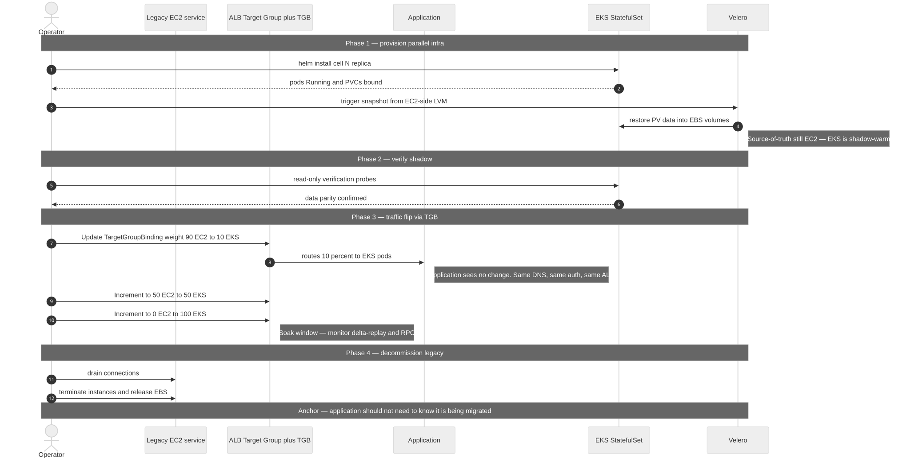

# aegis-statefulset

> Stateful Kubernetes workload management — proof-of-concept reference architecture
> for LevelDB-backed applications. Single-master-AZ topology, cold DR via Velero,
> Strangler-Fig migration support. Anonymised; portable across organisations.


---

## What this is

A parameterised reference architecture for hosting stateful, LevelDB-backed
applications on Amazon EKS at Mittelstand-scale B2B SaaS. Built around three
constraints: customer data on EBS is the only irreplaceable asset; operational
overhead must be carriable by a small SRE team; cost must scale linearly with
cell count (~$2,700/month at POC `cells.count=1`). The architecture stays
invariant across customer profiles — only `values.yaml` configuration moves.

## Who is this for

| You want to… | Start here |
|---|---|
| Review the take-home submission | [`docs/SUBMISSION.md`][submission] |
| Understand the architecture | [`docs/architecture-overview.md`][overview] |
| Read every decision | [10 thematic ADRs][adr-index] |
| Operate the platform | [Operations runbooks][ops] + [8 default dashboards][dashboards] |
| Quick-start a deployment | [Quick start](#quick-start) below |
| Adapt to your context | [Configuration knobs](#configuration) + [`values.yaml`][values] |
| Plan the long-term evolution | [Future-plans hub][future] — 5-horizon roadmap, triggers, cost trajectory |

[submission]: docs/SUBMISSION.md
[overview]: docs/architecture-overview.md
[adr-index]: docs/adr/INDEX.md
[future]: docs/future/README.md
[ops]: docs/operations/
[dashboards]: gitops/grafana/dashboards/
[values]: helm/aegis-statefulset/values.yaml

---

## Quick start

```bash
# Prerequisites
#   aws CLI configured, terraform >= 1.6, helm >= 3.13, kubectl >= 1.28

# 1a. One-time per AWS account: provision the terraform state backend
#     (S3 bucket with native locking). See infrastructure/terraform/bootstrap/README.md
cd infrastructure/terraform/bootstrap
terraform init && terraform apply
terraform output -raw backend_hcl_template > ../backend.hcl
cd ..

# 1b. Provision AWS infrastructure (main composition)
terraform init -backend-config=backend.hcl
terraform plan -out=tfplan && terraform apply tfplan

# 2. Configure kubeconfig
aws eks update-kubeconfig --name aegis-statefulset-prod --region eu-central-1

# 3. Bootstrap ArgoCD (one-time)
kubectl apply -n argocd -f gitops/argocd/projects/
kubectl apply -n argocd -f gitops/argocd/applications/observability-stack.yaml

# 4. Deploy applications (dev environment)
kubectl apply -n argocd -f gitops/argocd/applications/aegis-statefulset-dev.yaml

# 5. Verify
kubectl get statefulset -n aegis-app-dev
helm test aegis-statefulset -n aegis-app-dev
```

Production sync is **manual** by design — see [`gitops/argocd/README.md`](gitops/argocd/README.md) and ADR-08.

---

## Architecture at a glance

Two organising principles plus one reliability discipline anchor every decision.

**P1 — Data on EBS is the only irreplaceable asset; everything else is declarative.**
Customer state lives on encrypted EBS volumes — split per-pod into `data` and `wal`
PVCs (Path γ multi-PVC; literal LVM available as opt-in patch per ADR-02). Cluster,
deployments, routing tables, container images, AZ topology — all reproducible in
30–60 minutes from Helm + Terraform.

**P2 — RPO is a configurable trade-off, not a fixed floor.**
Default 5-min cadence yields typical recovery point ~30 sec; the lever is exposed
in `values.yaml`; the cost-RPO curve is documented for operator self-tune.

**P3 — Conservative on recovery, aggressive on failure detection.**
Detection 50% unhealthy / 2 min sustained; recovery 95% healthy / 60 min sustained;
asymmetric thresholds prevent flap. No auto-failback ever.

### Key choices

- **Per-tenant pod identity** — LevelDB is single-writer, file-based, no native replication; hash-sharding doesn't fit the storage primitive [^adr01]
- **Single master AZ + warm-standby AZs** — cross-AZ chatter on a stateful tier without replication is wasted latency and double cost; AZ-B/C node groups sit at `desired=0` until a rotation event [^adr01]
- **Multi-PVC storage (data + WAL) on EBS gp3** — the spec named LVM; modern K8s database operators (TiDB / K8ssandra / CloudNativePG) deliver the same WAL/data IO isolation + crash-consistent snapshot benefits via two PVCs + CSI VolumeSnapshot, without privileged init container or Kyverno PolicyException; literal LVM available as opt-in patch [^adr02] [^lvm-patch]
- **Velero CSI Snapshot path** — the spec named Restic + LVM; Velero still wraps Restic / Kopia in its File System Backup (FSB) path, so the transport changed, not the toolchain [^velero-vs-restic]
- **Cold DR over multi-region active-passive** — LevelDB has no sync APIs, so warm replicas are snapshot copies; the cost delta buys RTO that doesn't fit the ~25-min target [^cold-dr]
- **DynamoDB Global Tables placement table** — 6-property contract (atomic compare-and-swap (CAS) / strong reads / multi-AZ durable / low latency / change-data-capture (CDC) / audit log); customer can substitute any backend that satisfies it [^adr03]
- **Strangler-Fig migration at the infrastructure layer** — application container untouched; cell-by-cell cutover via placement-table flip [^adr05]
- **Three-Layer DR** — Terraform infra / Helm via terraform `helm_release` for cluster controllers / Velero for application + data; each layer the right tool, no double management [^adr04]
- **OpenTelemetry (OTel)-only instrumentation** — vendor-neutral at the instrumentation layer; backend (Grafana Cloud or Amazon Managed Prometheus + Grafana) reversible [^adr06]
- **Defense in depth** — Edge TLS → NetworkPolicy → Pod Security Standards (PSS) → Cosign admission → External Secrets Operator (ESO) + IAM Roles for Service Accounts (IRSA) → per-tier KMS → eBPF runtime → tamper-protected audit [^adr07]
- **SHA pin + Supply-chain Levels for Software Artifacts (SLSA) L3 + Software Bill of Materials (SBOM)** — five lines of YAML buy audit-grade chain of custody [^adr09]
- **Cost-as-architecture** — tagging discipline + AWS Budgets + Cost Anomaly Detector + per-tenant Cost and Usage Report (CUR) + Athena attribution + Savings Plans strategy; day-1, not bolted on [^adr10]

[^adr01]: [`docs/adr/ADR-01-architecture-and-topology.md`](docs/adr/ADR-01-architecture-and-topology.md)
[^adr02]: [`docs/adr/ADR-02-storage-and-pv-mapping.md`](docs/adr/ADR-02-storage-and-pv-mapping.md)
[^lvm-patch]: [`docs/future/lvm-init-patch.md`](docs/future/lvm-init-patch.md) — opt-in literal-LVM init container patch
[^adr03]: [`docs/adr/ADR-03-routing-and-ingress.md`](docs/adr/ADR-03-routing-and-ingress.md)
[^adr04]: [`docs/adr/ADR-04-backup-dr-and-ha.md`](docs/adr/ADR-04-backup-dr-and-ha.md)
[^adr05]: [`docs/adr/ADR-05-migration-strangler-fig.md`](docs/adr/ADR-05-migration-strangler-fig.md)
[^adr06]: [`docs/adr/ADR-06-observability.md`](docs/adr/ADR-06-observability.md)
[^adr07]: [`docs/adr/ADR-07-security-and-runtime.md`](docs/adr/ADR-07-security-and-runtime.md)
[^adr09]: [`docs/adr/ADR-09-supply-chain.md`](docs/adr/ADR-09-supply-chain.md)
[^adr10]: [`docs/adr/ADR-10-finops.md`](docs/adr/ADR-10-finops.md)
[^velero-vs-restic]: [`docs/operations/why-velero-not-restic.md`](docs/operations/why-velero-not-restic.md)
[^cold-dr]: [`docs/operations/why-cold-dr.md`](docs/operations/why-cold-dr.md)

---

## Visual tour

### Request flow — ALB → API → Envoy → StatefulSet


Edge / business-logic / routing / state are decoupled tiers. Each tier scales on its own shape — API on QPS, Envoy on routing-table churn, StatefulSet on tenant count. Pattern recognition, not invention: Vitess `vtgate`, DynamoDB request router, Stripe and Reddit shard-routers all do the same separation [^adr03].

### Backup data flow — Velero CSI Snapshot per PVC


Velero pre-hook quiesces the app, then CSI VolumeSnapshot fires per PVC (both `data` and `wal` snapshot atomically), then EBS Snapshot lands in S3, then cross-region copy ships to Glacier IR. Dual-cadence schedules: Schedule A (5-min, source-region only) for operational restore; Schedule B (4-h, cross-region) for DR-tier [^adr04] [^velero-vs-restic].

### DR cutover — three paths based on what survived


Recovery shape depends on the failure shape. Path A (EBS intact) is fastest; Path B (stateless tiers gone, EBS intact) means redeploy via Helm + reattach; Path C (region failure) means cross-region Velero restore. Each path has its own runbook + bounded RTO target [^cold-dr] [^adr04].

### Multi-tenancy isolation — three tiers


Three deployment-time tiers map cleanly to compliance posture: dedicated account / dedicated VPC / shared cluster + namespace. Runtime isolation enforcement (NetworkPolicy, IRSA, per-tier KMS) is the consequence, not the choice [^adr01] [^adr07].

### Migration — Strangler Fig at the infrastructure layer



Application container untouched. Migration substrate change happens at the routing layer via TargetGroupBinding weights — 90/10, 50/50, 0/100, with soak-window monitoring at each step. The anchor: *"the application should not need to know it's being migrated"* [^adr05].

### Automation tier matrix — failure-mode catalog



Every named failure mode is classified into one of three columns: auto-recovered / semi-auto (runbook-driven) / manual operator. The principle from P3 — detection automatic, execution manual — maps directly to this matrix. Optional opt-in patches in `docs/future/` upgrade specific cells from semi-auto to auto [^adr04].

---

## Configuration

The operationally consequential knobs are summarised below; full schema lives in [`helm/aegis-statefulset/values.yaml`](helm/aegis-statefulset/values.yaml).

| Knob | Default | Trade-off |
|---|---|---|
| `backup.operational.cadence_minutes` | `5` | Lower = tighter RPO + higher EBS Snapshot / S3 cost; spec ceiling 6 h |
| `backup.dr.cadence_hours` | `4` | DR-tier cadence; ≤ 5 h is the sane upper bound against the 6 h RPO ceiling |
| `stateful.cells.count` | `1` | POC default 1; production matches existing partitioning per ADR-05 |
| `stateful.startup_probe.failure_threshold` | `60` | 60 × 30s = 30 min cold-start window for production LDB MemTable rebuild |
| `stateful.cells.storage.data` / `.wal` | `1843Gi` / `205Gi` (prod) | Multi-PVC split (Path γ per ADR-02); both PVCs CSI-snapshotted atomically; online-expandable via CSI resize |
| `master_az` | `eu-central-1a` | Master AZ for all workloads; rotation via `aws eks update-nodegroup-config` |
| `dr_region` | `eu-west-1` | Cross-region DR target for EBS Snapshot copy |
| `routing.backend` | `dynamodb` | Customer can substitute any backend that satisfies the 6-property contract |
| `observability.backend` | `grafana_cloud` | `grafana_cloud` or `amp_amg` — OTel-instrumented, backend reversible |

---

## Repository layout

```
aegis-statefulset/
├── helm/aegis-statefulset/    # Helm chart (templates, values, environment overlays)
├── infrastructure/terraform/  # AWS layer (VPC, EKS, IAM, S3, KMS, FinOps, audit)
├── scripts/                   # Backup / DR / migration / chaos / FinOps
├── gitops/                    # ArgoCD apps, Kyverno policies, Grafana dashboards
├── docs/                      # 10 thematic ADRs, ops runbooks, architecture overview
├── app/                       # POC mock binary (~80 lines Go; not real LevelDB)
└── .github/workflows/         # 4 main + 4 supporting CI workflows
```

Full per-file breakdown: [`docs/architecture-overview.md`](docs/architecture-overview.md).

---

## Operational overhead awareness

The architecture ships maintenance surface — and acknowledges it on its own
terms. Three tools to operate (Velero / EBS Snapshot / ArgoCD), six runbooks
for human-side operations, ten thematic ADRs (originally split across fifty
private predecessors), pre-commit's five-check enforcement gate, and a CI
surface of four primary workflows plus four supporting. This is the senior
platform-engineering job in audit-grade SaaS — not a side-effect to apologise
for. Full breakdown plus the small-platform-team carrying-capacity argument:
[`docs/SUBMISSION.md` § 7a][ops-overhead].

[ops-overhead]: docs/SUBMISSION.md#7a-operational-overhead--honest-accounting

---

## Verification

```bash
helm lint helm/aegis-statefulset/
helm template helm/aegis-statefulset/ | kubeconform -strict -summary
cd infrastructure/terraform && terraform fmt -check -recursive && terraform validate
shellcheck scripts/**/*.sh
./scripts/git-hooks/pre-commit
```

Full local validation matrix: [`CONTRIBUTING.md`](CONTRIBUTING.md).

---

## Status

Proof-of-concept submission for a take-home challenge. Architecture is stable;
implementation is skeletal by design — the submission covers structural depth
(10 thematic ADRs across 14 domains, parameterised topology, FinOps + GitOps +
DevSecOps three-pillar discipline) over surface coverage. Anonymised for
portability; reusable as a reference architecture for stateful Kubernetes
workloads at Mittelstand-scale B2B SaaS.

## License

MIT — see [`LICENSE`](LICENSE).
