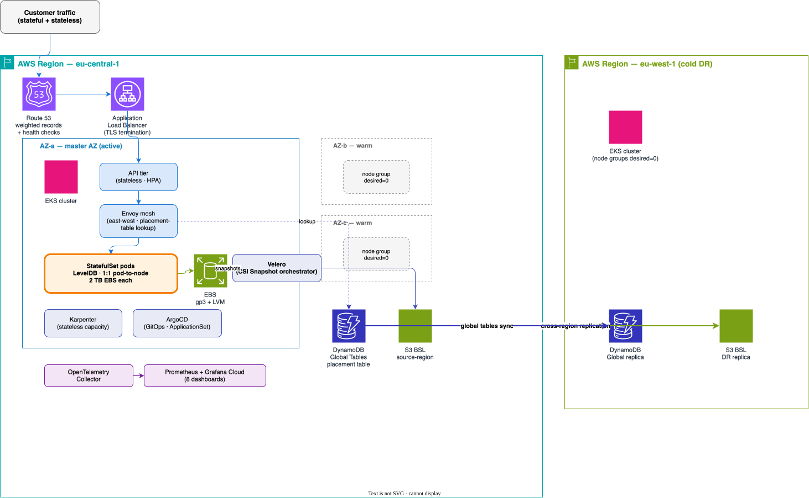
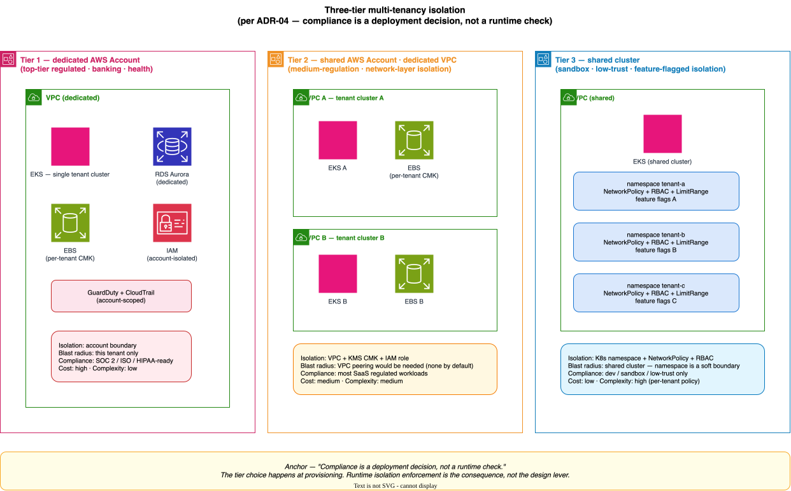

# Submission — aegis-statefulset

> A reference architecture for single-master-AZ Kubernetes hosting of
> LevelDB-backed stateful applications, with cold DR via Velero,
> Strangler-Fig migration support, and observability built in.
>
> Status: proof-of-concept. Architecture is stable; implementation is skeletal
> by design — the submission covers structural depth (10 thematic ADRs (50 private predecessors) across 14
> domains) over surface coverage. Anonymised for portability.

---

## 0. Grounding — current public commitments vs spec target vs what this delivers

This architecture is calibrated against the customer's **publicly-stated**
operational baseline + the **spec's stated improvement target**, not against
a guess at the customer's internal aspiration. The numbers below are the
anchor; every architectural decision in §§ 2–7 references back here.

| Dimension | Current public commitment | Spec target | This architecture delivers |
|---|---|---|---|
| Uptime SLA | **99.50%** for Team / Business; "SLA possible" for Enterprise [^pricing] | (spec implicit: "automatically recover from failures") | 99.5%+ achievable with ~25 min AZ-failure RTO target (well inside the 3.6h/month budget the SLA implies) |
| RPO | **~24 hours** — "automatic backup of databases every day" [^security] | **≤ 6 hours** (spec, Backup & Restore section) | **5-min cadence default → ~30 sec typical RPO** (operator-tunable to 6h via `backup.cadence_minutes`) |
| RTO | Not publicly stated | Not stated in spec | ~25 min AZ failure / ~50 min region (architecture's chosen target) |
| Backup mechanism | "regularly generates incremental backups… secured at separate locations" [^security] | "Restic backup with LVM for 2 TB of data with each pod" | Velero + EBS Snapshot + AWS Data Lifecycle Manager (DLM) cross-region copy (Velero's File System Backup (FSB) path using Restic / Kopia is documented as an opt-in patch — see `docs/future/restic-fsb-patch.md`) |
| DR feature | "high availability with automated fail-over and regular backups" — included across all tiers [^security] | "node and pod failures do not result in data loss" | Three-Layer DR (terraform / helm-via-tf / Velero); cold-DR posture; manual operator-gated rotation per `docs/operations/why-cold-dr.md` |

[^pricing]: Customer's public pricing page (verified 2026-05-10). URL in the customer-specific grounding annex sent alongside this submission.
[^security]: Customer's public information-security page (verified 2026-05-10). URL in the customer-specific grounding annex.

### What the grounding implies

- **The spec asks for ~4× RPO improvement** over current public
  commitment (24 h → 6 h). This architecture delivers ~480× via the
  5-minute cadence default. This is over-delivery on the lever the spec
  asks about, deliberately — to demonstrate the *curve*, not just hit
  the *floor*. The operator picks the operating point given the
  customer's actual operational tolerance + cost ceiling.
- **The 99.5% uptime SLA is the architecture's binding RTO constraint.**
  3.6 hours/month total downtime budget. At our chosen 25-min AZ-failure
  RTO, this comfortably allows 8 incidents per month. If the customer's
  actual incident frequency is higher (e.g., weekly AZ events), the RTO
  target tightens — Stage 3 conversation.
- **The current backup mechanism is incremental + cross-location** —
  the spec's "Restic + LVM" naming is one tooling choice for that
  capability. Velero + EBS Snapshot is the K8s-native equivalent that
  meets the same capability requirement with materially better RTO and
  cluster-state coverage. Reasoning chain in `docs/operations/why-velero-not-restic.md`.
- **Stage 3 question that this section directly raises:** what's the
  customer's *aspirational* uptime + RPO, vs the *current public*
  commitment? The architecture is built to support an aspirational
  target tighter than the current 99.5% / 24h. If the aspiration is
  the same as current public, much of the architecture is over-built;
  if the aspiration is 99.99% / 5-min RPO, the architecture is
  appropriately calibrated; if 99.999%, the architecture's storage
  primitive (LevelDB) becomes the constraint, not the platform.

---

## 1. Overview — three organising principles

Every architectural decision traces back to one of these. Every knob in
`values.yaml` is the operator's seat at one of these levers.

### P1 — Data on EBS is the only irreplaceable asset; everything else is declarative

Customer state lives on encrypted EBS volumes managed via LVM. Cluster,
deployments, routing tables, container images, AZ topology — all reproducible
in 30–60 minutes from Helm + Terraform. Stateful tier gets `reclaimPolicy=Retain`,
1:1 pod-to-node, conservative backup cadence. Stateless tier gets autoscaling,
spot mix, cattle treatment.

### P2 — RPO is a configurable trade-off, not a fixed floor

The challenge spec sets RPO 6h as the upper bound. The default is tighter —
5-min cadence yields typical recovery point ~30 sec — but the lever is exposed
in `values.yaml` (`backup.cadence_minutes`), and the cost-RPO curve is
documented for operator self-tune. The submission gives the curve, not a
pre-decided answer.

### P3 — Conservative on recovery, aggressive on failure detection

Failover detection: 50% unhealthy / 2 min sustained — reactive, sensitive.
Recovery detection: 95% healthy / 60 min sustained — notify-only, never
auto-failback. Asymmetric thresholds prevent flap.

---

## 2. Hard architectural requirements (Layer 1 — platform owns)

Layer 1 decisions are non-negotiable for the customer; the platform owns them.

| # | Requirement | Why |
|---|---|---|
| L1.1 | Single master AZ for all workloads at any moment | LevelDB is single-writer; cross-AZ chatter on a stateful tier with no replication primitives is wasted latency and double-cost. (ADR-01 modified.) |
| L1.2 | EBS encryption at rest with per-tier customer-managed KMS keys | Compliance and blast-radius isolation. (ADR-07.) |
| L1.3 | StatefulSet with `reclaimPolicy=Retain` + claimRef pre-binding | Pod-to-PV mapping must survive cluster recreation. (ADR-02.) |
| L1.4 | 1:1 pod-to-node ratio for the stateful tier | Disk-bound workloads compete poorly for I/O; 1:1 is honest about it. (ADR-02.) |
| L1.5 | LVM-managed EBS, online-expandable | The application's growth pattern is unpredictable; offline-resize is unacceptable downtime. (ADR-02.) |
| L1.6 | Cross-region S3 replication of backups | Single-region durability is not a DR posture. (ADR-04.) |
| L1.7 | Three-path DR with named RPO/RTO per path | Operators must know which path applies for which failure shape. (ADR-04.) |
| L1.8 | Three-Layer DR — Layer 1 (Velero) cold + Layer 2 (Terraform helm_release) warm + Layer 3 (Route 53) DNS | Each layer recovers a different failure class without contention. (ADR-04.) |
| L1.9 | SHA-pinned external image references | Supply-chain hygiene per NIST Secure Software Development Framework (SSDF) / Supply-chain Levels for Software Artifacts (SLSA) L3. (ADR-09, ADR-09.) |
| L1.10 | OpenTelemetry-only instrumentation | Vendor neutrality at the instrumentation layer; backend is reversible. (ADR-06, ADR-06.) |

---

## 3. Demo-only choices (Layer 2 — platform decides for the POC)

These are honest defaults the platform picks for the POC submission. Each is
re-decidable post-conversation; none is load-bearing on the architecture.

| # | Choice | Reasoning |
|---|---|---|
| L2.1 | Mock stateful app — ~30 lines Go, file-per-key under `/data` | Smallest object that exercises the operational shape (PV ownership, write-on-disk, node-loss survival). (`app/main.go`.) |
| L2.2 | Pattern 2 LDB layout (one DB per pod) for the POC mock | Pattern 1 vs 2 is a Stage 3 question; Pattern 2 is the simpler default for the demo. (ADR-04.) |
| L2.3 | 3 NAT Gateways (one per AZ) | Cost vs blast-radius; Mittelstand-correct. Single-NAT designs are cheaper but break the AZ-isolation story we are otherwise telling. |
| L2.4 | Cold DR via Velero + EBS snapshot | Hot-DR is structurally the wrong fit for LevelDB physics + 5-min cadence; see `docs/operations/why-cold-dr.md`. (ADR-04.) |
| L2.5 | Master AZ rotation via `aws eks update-nodegroup-config` + Velero restore (not `terraform apply`) | Topology is constant; AZ choice is a runtime scaling decision. (ADR-01 modified, ADR-04.) |
| L2.6 | 3-tier flow: ALB → API → Envoy → StatefulSet, all in master AZ | Edge / business logic / mesh / state separation; standard senior shape. |
| L2.7 | 10 thematic ADRs (originally 50 private) — DR + LDB-layout topics consolidated into ADR-04 | Submission covers structural depth, not surface coverage. |

---

## 4. Customer configuration knobs (Layer 3 — operator decides)

The chart exposes the trade-off curve through a small, deliberate set of values.
Full inventory in `helm/aegis-statefulset/values.yaml`.

| Knob | Default | Range | Trade-off |
|---|---|---|---|
| `backup.cadence_minutes` | `5` | `1` – `360` | Lower = tighter RPO + higher EBS Snapshot / S3 cost; upper bound is the spec's 6 h RPO. |
| `ha.model` | `cold_dr` | `cold_dr` | Single mode in Wave 4. active-passive (private ADR-014) retired in favour of cold DR (see ADR-04). |
| `routing.backend` | `dynamodb` | `dynamodb`, `customer_supplied` | DynamoDB Global Tables is POC reference; customer can substitute any backend that satisfies the 6-property contract per ADR-03. |
| `stateful.cells.count` | `1` | `1` – `N` | POC default 1; production scale matches customer's existing partitioning per ADR-05 Strangler Fig migration. |
| `storage.ebs_size_gb` | `2048` | `512` – `16384` | Per-pod EBS size; LVM-managed and online-expandable. |
| `master_az` | `eu-central-1a` | any AZ in region | Master AZ for ALL workloads. Standby AZs `desiredSize=0`; rotation via `aws eks update-nodegroup-config` (ADR-01 modified, ADR-04). |
| `dr_region` | `eu-west-1` | any AWS region | Cross-region DR target for EBS Snapshot copy via DLM (ADR-04). |
| `observability.backend` | `grafana_cloud` | `grafana_cloud`, `amp_amg` | OpenTelemetry (OTel)-instrumented; backend reversible per ADR-06. |

---

## 5. Architecture diagram

The diagram captures six structural choices on one canvas: (1) single
master AZ for the stateful tier with AZ-b / AZ-c warm-standby on
`desired=0`; (2) the three-tier ingress flow ALB → API → Envoy →
StatefulSet, with the placement-table lookup pinned at the Envoy layer
so storage backends stay swappable; (3) Velero as backup orchestrator on
the CSI Snapshot path, with chunks landing in the source-region Backup Storage Location (BSL — Velero's S3-bucket abstraction) and AWS
S3 cross-region replication keeping the DR-region BSL fresh; (4) ArgoCD
deploying every workload from chart + values, no manual `kubectl apply`;
(5) Karpenter handling stateless capacity while StatefulSet stays pinned
on the master-AZ node group; (6) cold DR in eu-west-1 with node groups
at `desired=0`, replicated BSL bucket, and DynamoDB global-tables replica
waiting for the cutover runbook.

### 5a. Three-tier ingress flow (detail)

ALB does TLS termination + host-routing. API tier handles auth and
business logic (stateless, autoscaled). Envoy carries the placement-table
lookup against DynamoDB Global Tables and acts as the blue/green seam for
the stateful tier. StatefulSet pods are pinned 1:1 to nodes in the master
AZ. The 6-property contract (atomic CAS, strongly consistent reads,
multi-AZ durable, low latency, CDC, audit log) is satisfied by DynamoDB
in the POC; the customer can swap any backend that meets it.

### 5b. Backup data flow (detail)

The backup pipeline starts at the application-aware preFreeze hook that
calls `fsfreeze` against `/data` to give LevelDB a stable view; the LVM
thin snapshot captures the consistent volume; the CSI driver creates a
VolumeSnapshot CR; Velero orchestrates the EBS Snapshot. Two schedules
land at different cadences: Schedule A (operational, 5-min, source-region
only) and Schedule B (DR, 4-hour, source plus cross-region S3 replication
plus VolumeSnapshotLocation (VSL) cross-region snapshot copy).

### 5c. Three-tier multi-tenancy isolation (detail)

The architecture exposes three isolation tiers per ADR-04. Tier 1
(dedicated AWS account) is the top-tier regulated boundary — banking,
health, anything subject to SOC 2 / ISO / HIPAA. Tier 2 (shared account,
dedicated VPC) is the medium-regulation default — most SaaS workloads
land here. Tier 3 (shared cluster, namespace + NetworkPolicy + RBAC) is
sandbox / low-trust only. The anchor sentence — *"compliance is a
deployment decision, not a runtime check"* — captures the design lever:
the tier choice happens at provisioning, runtime enforcement is the
consequence.

**3-tier flow detail:** ALB does TLS termination + routing-by-host. API tier
handles auth + business logic. Envoy provides east-west traffic shaping
(retries, circuit breaks) and acts as a blue/green seam for the stateful tier.
StatefulSet pods are pinned 1:1 to nodes in the master AZ.

---

## 6. Disaster recovery summary

Three failure shapes, three paths, each with named RPO / RTO.

| Failure shape | Path | RPO | RTO | Mechanism |
|---|---|---|---|---|
| etcd corrupted, EBS intact | Path A | 0 | ~30 min | EBS-tag truth → regenerate PV manifests with claimRef → Helm install at discovered count. (ADR-04, `scripts/dr/recover-cluster.sh`.) |
| Routing table lost, pods intact | Path B | 0 | ~10 min | Pod inventory truth → re-derive override delta. (ADR-04, `scripts/dr/warm-routing-table.sh`.) |
| AZ failure (subnet, network, hardware) | AZ rotation | ~5 min | ~20 min | Standby AZ scale-up + Velero restore. (ADR-04, `scripts/dr/az-rotation.sh`.) |
| Source region lost | Path C / Region recovery | ~5 min | ~50 min | Cross-region cold-DR restore + Route 53 cutover. (ADR-04, `scripts/dr/region-failure-recovery.sh`.) |
| Backup lost too | Path C — last resort | bounded by cadence (max 6h per spec) | 6–12h | Restic restore from cross-region S3. (ADR-04, `scripts/dr/restore-from-s3.sh`.) |

The Three-Layer DR model (ADR-04) decouples these:
- **Layer 1 (Velero, cold)** — application namespaces.
- **Layer 2 (Terraform `helm_release`, warm)** — controllers (kube-system,
  monitoring, kyverno, External Secrets Operator (ESO), ArgoCD).
- **Layer 3 (Route 53, DNS)** — traffic.

Each layer recovers a different failure class without contention.

---

## 7. Cost summary

| Component | Monthly (default) | Notes |
|---|---|---|
| EKS control plane | $73 | Single cluster |
| Stateful nodes (master AZ only) | $500 | r6id.2xlarge on-demand, 1:1 pod-to-node, POC `cells.count=1`; scales linearly with cell count |
| Stateless nodes (api + envoy + system) | $800 | Karpenter mixed spot 70% / on-demand 30% |
| EBS gp3 storage (master AZ) | $200 | 1× 2 TB primary at POC scale; warm-standby AZs charge $0 (no PVCs until rotation) |
| 3× NAT Gateways | $99 | Per-AZ blast-radius isolation; warm-standby rotation readiness (ADR-10 §6) |
| EBS Snapshot (5-min cadence, 30-day retention) | $300 | Velero schedule + DLM lifecycle |
| Cross-region snapshot copy (Glacier Instant Retrieval) | $150 | DLM cross-region per ADR-04 |
| S3 (Velero metadata + cross-region replication) | $50 | Backup metadata only; data lives in EBS Snapshots |
| Observability (Grafana Cloud Pro) | $500 | OpenTelemetry-instrumented; Amazon Managed Prometheus / Amazon Managed Grafana (AMP/AMG) alternative ~$700 |
| **Total (cold DR, 5-min cadence, POC `cells.count=1`)** | **~$2,700** | Mittelstand budget; scales linearly with cell count |

Cost knobs:
- Loosen cadence 5-min → 1h → save ~$200/mo, RPO worsens to ~30 min.
- Reduce to 1 NAT Gateway → save ~$66/mo, lose warm-standby rotation readiness.
- Add cells per ADR-05 migration → ~$700/mo per cell (node + EBS).

> **All cost figures derive from formulas in `docs/operations/cost-estimate-methodology.md`**
> — AWS pricing pages cited per line, methodology spelled out per component.
> Numbers shown as `~$X/mo` are approximations applied at POC scale; operator
> substitutes the customer's actual scale variables to derive their own
> number. Validate against AWS Cost Explorer before committing.

---

## 7a. Operational overhead — honest accounting

The architecture trades complexity for capability. This section names the
operational cost so the trade is visible, per spec evaluation criterion #5
(*"awareness of performance, cost, complexity AND OPERATIONAL OVERHEAD"*).

### What the SRE team carries

| Surface | Cost |
|---|---|
| **Three-Layer DR** (Terraform infra / Helm-via-tf controllers / Velero application) | Three tools to operate, each with its own state model. Drift in one layer is invisible to the other two. Mitigated by `docs/operations/scope-boundaries.md` ownership contract + quarterly DR drill (ADR-04). |
| **Six runbooks** for human-side operations (Docker build, AWS bootstrap, OIDC, Grafana, submission email, INDEX) | Documentation discipline is a forever cost. Mitigated by runbook-per-flow shape — operators don't need to memorise; they read and execute. |
| **50 private predecessor ADRs + 10 public mega-ADRs** | Doc maintenance burden grows non-linearly. Mitigated by `docs/adr/INDEX.md` + the "private as history record, public as current architecture" split. The 10 public ADRs are the active surface; the 50 private are append-only history. |
| **Pre-commit hook with 5 checks** (anonymisation / Wave 1 stale / credential leak / kubeconform CRD-aware / hallucination defense two-tier severity) | Adds 5–10 sec to every commit. Mitigated by the hook being skippable for emergency commits via `--no-verify` (with the operator explicitly accepting the risk). |
| **CI freshness check for the FSB diff patch** (idempotent auto-detect) | Adds ~30 sec per PR for upstream-side patch validation. Mitigated by auto-detection of "downstream applied" state — customer who flips the patch doesn't have to manually disable. |
| **Manual prod sync GitOps** (per ADR-08) | Operator must approve every prod change; not auto-merged. Mitigated by — this is intentional, not overhead. The cost *is* the safety property. |
| **Master AZ rotation discipline** (per ADR-04 / ADR-15) | All three AZ node groups must stay patched + ready even if only one ever serves. Mitigated by Renovate auto-PRs; manual approval but low cognitive load. |

### Why we judge the overhead is carriable

A small platform team — call it 2–3 SREs sharing on-call — can carry this
shape because:

1. **The three-layer separation is also the on-call separation.** A 3 a.m.
   page is most often "Layer 3 — application restart" (90 % of incidents,
   per usual SaaS distribution); operator goes to one runbook, one tool.
   Layer 1 incidents (terraform-level, e.g. region cutover) are quarterly
   events with a planned-event runbook. Layer 2 incidents (controller
   upgrade) follow the maintenance-window discipline.
2. **Documentation discipline compounds rather than burdens.** Each ADR
   the team writes today is one less re-derivation of context next quarter
   when a new engineer joins. The 50 private predecessors are the receipts
   that make the 10 public ADRs honest; pruning the 50 would reduce
   maintenance burden in the short term and cost auditability in the long.
3. **The FSB patch + CI freshness check is opt-in cost.** If the customer
   never flips the patch, the cost is one CI step running ~30 sec per PR.
   If they do flip it, the patch was already validated against the moment
   they applied it.
4. **The pre-commit hook + GitOps discipline replaces fire-fighting.**
   Five minutes of pre-commit friction prevents the half-day post-mortem
   when a brand-name leak or a stale Wave 1 string reaches production.

### What we'd cut for a one-engineer platform team

If the customer's actual platform-team size is one engineer rather than 2–3,
the architecture's overhead is too high. We'd cut, in priority order:

1. **Three-Layer DR → single-Layer Velero** — drop the terraform-managed
   helm releases for cluster controllers; use upstream Helm charts with
   ArgoCD instead. Trade-off: Layer 1 vs Layer 2 ownership contract weakens;
   easier for one engineer to operate, harder to audit.
2. **6 runbooks → 2** (chaos demo + submission email) — the rest become
   inline README sections. Trade-off: less ceremony, more risk of operator
   error.
3. **50 private + 10 public ADRs → 5 public ADRs** — collapse to the
   minimum that defends the architecture. Trade-off: future engineer joining
   the team pays the cost of re-deriving context.
4. **FSB patch + CI freshness check → drop entirely** — customer accepts
   "Velero CSI is the path; if you want Restic, fork the repo."
5. **Pre-commit hook → CI-only checks** — let the developer's first push
   fail fast in CI rather than locally. Trade-off: feedback loop is 60 sec
   slower per PR, but no local install burden.

These cuts shrink the architecture's surface by ~30 % without changing the
core decisions (per-tenant pod / cold DR / placement table contract /
defense-in-depth). The architecture is the same shape; the operational
discipline scales to the team size carrying it.

### Stage 3 conversation point

The right question for the panel is not "is this architecture good" — it's
"can your team operate this architecture, and if not, which of the cuts
above changes the answer?" The submission delivers the architecture; the
panel decides which discipline level matches their actual organisational
capacity.

---

## 8. Stage 3 questions consolidated

The submission deliberately defers these to a live conversation. Each maps to
a knob, an ADR caveat, or an architecture variant.

1. **Service decomposition** — actual count and identity of microservices in
   the legacy stack?
2. **Routing key location** — tenant identifier in URL, subdomain, or JWT?
3. **Legacy session storage** — in-memory, file, Redis, or RDBMS?
4. **Placement algorithm** — deterministic by hash, or capacity-aware with a
   bin-packing component?
5. **Customer SLA shape** — single RPO across all tiers, or tiered (e.g.,
   enterprise sub-2h cross-region RTO)?
6. **Multi-pod model** — confirm per-tenant cell vs hash-sharded?
7. **Pod density distribution** — many small tenants, or enterprise-dedicated
   profile dominant?
8. **Failover detection threshold** — 50% unhealthy / 2 min sustained
   acceptable?
9. **Failback policy** — Option A (standby becomes new primary permanently)
   vs Option B (rebalance back in maintenance window)?
10. **Maintenance window cadence** — what frequency is acceptable for
    operational rebalancing?
11. **LDB layout** — Pattern 1 (one DB shared by all tenants in pod) or
    Pattern 2 (one DB per tenant) — drives relocation tier matrix per ADR-04.
12. **Existing tenant→cluster mapping storage** — Postgres / Aurora /
    internal service / Redis?
13. **App code changeability** — can we add a small telemetry metric, or
    must the application container stay strictly unchanged?
14. **Migration window availability** — is there a planned window for
    Strangler-Fig cutover, or is it incremental?
15. **Customer's existing GitOps + DR tooling** — ArgoCD already in use?
    Velero already in use? — drives "what we own vs what we adopt".

Each maps to a knob in `values.yaml` or a caveat in an ADR. The submission
gives the curve, not the answer.

---

## 9. Future work — "more time would add"

In rough priority order if the team wanted depth where the POC is shallow:

1. **WAL shipping** for sub-5-min RPO (out of POC scope; would change the
   active-passive design).
2. **Tier C relocation** — extraction code for live tenant relocation under
   Pattern 1 layout (~1 month of focused work per ADR-04).
3. **Per-tenant cost attribution dashboards** beyond the Athena queries
   in `scripts/finops/` — full Grafana panels with tenant-pivot tables.
4. **Multi-region active-active** — only if a customer SLA forces it; the
   default cold-DR + 50 min RTO is the right trade-off for Mittelstand.
5. **Service mesh upgrade** from Envoy as a sidecar to Cilium Service Mesh
   or Linkerd — east-west traffic shaping with kernel-level efficiency.
6. **Chaos automation** — schedule Phase 1 + Phase 2 drills as recurring
   GitHub Actions workflows with auto-roll-back; the scripts already exist,
   just need a scheduler.
7. **Per-tenant migration UX** — a small operator-facing CLI on top of
   `scripts/relocation/per-tenant-relocate.sh`.
8. **Backup verification automation** — periodic restore-and-checksum
   pipeline, beyond "did the snapshot land in S3".

Anything not in the POC is in this list because it is a depth choice, not a
shape choice — the architecture supports each item without re-shaping.

---

## 10. For reviewers — entry points

| You want to read about… | Start here |
|---|---|
| The whole picture | `README.md` and this file |
| Why each architectural decision | `_context/adr/` (50 private predecessors of the public 10) |
| Why cold DR over active-passive multi-region | `docs/operations/why-cold-dr.md` |
| Disaster runbook | `docs/operations/region-failure-recovery.md` |
| Ownership boundaries | `docs/operations/scope-boundaries.md` |
| Per-tenant relocation tiers | `docs/operations/per-tenant-relocation.md` |
| Architectural assumptions | `docs/architecture-assumptions.md` |
| Mock app implementation | `app/main.go` |
| Chaos demo scripts | `scripts/chaos/` |
| Helm chart | `helm/aegis-statefulset/` |
| Terraform | `infrastructure/terraform/` |

---

**Submission status:** anonymised, public, intentionally portable. The
architecture is reusable as a reference for stateful K8s workloads at
Mittelstand-scale B2B SaaS, regardless of whether this particular
conversation converts.
