# Per-tenant relocation — tier'd capability matrix

> Capability matrix for live tenant relocation, indexed by application
> data layout (Pattern 1 vs Pattern 2 per ADR-04) and the level of
> application changeability.

The capability to relocate a single tenant from one pod (or cell) to
another is gated by two factors, neither of which is fully under the
platform's control:

1. **Application data layout** — Pattern 1 (one shared LDB per pod,
   tenants co-located) vs Pattern 2 (one LDB per tenant).
2. **Application changeability** — can we add a small extraction or
   telemetry primitive, or must the container stay strictly unchanged?

The matrix below maps these two factors to four tiers of relocation
capability. Each tier names what the platform can offer and what it
cannot.

---

## The matrix

| Tier | Layout | App changes | Capability |
|---|---|---|---|
| **A** | Pattern 1 (shared) | None | Relocation NOT enabled — only telemetry-aware pod migration |
| **B** | Pattern 1 (shared) | Small metric (one counter) | Telemetry-driven hot-tenant identification, but no per-tenant move |
| **C** | Pattern 1 (shared) | Extraction code (~1 month) | Full per-tenant relocation via app-level dump/load |
| **D** | Pattern 2 (per-tenant) | None | Full per-tenant relocation via filesystem-grained move |

### Visual — decision flow



Tier D (Pattern 2, no app changes) is the architectural sweet spot —
filesystem-grained relocation with zero application work. Tier C
(Pattern 1 + extraction code) achieves the same operational capability
but costs a month of application engineering. Tier B is the cheap
diagnosis-only stepping stone. Tier A is the no-investment baseline.

---

## Tier A — Pattern 1 + no app changes

**What we have:** A single LevelDB per pod, all tenants of that pod
sharing the same database files. The application offers no API to
extract one tenant's data; the container is immutable.

**What we can do:**
- Move *whole pods* between AZs (already supported via AZ rotation).
- Move *whole pods* to fresh nodes for hardware refresh (already
  supported via node group rotation).

**What we cannot do:**
- Move a single tenant out of an overcrowded pod.
- Pull a hot tenant onto a fresh, larger pod for capacity isolation.

**Why we cannot:** With shared-LDB and no extraction, the only "move
this tenant" path is to copy the entire shared LDB to the new pod —
which means moving all the cohabiting tenants too. That is a pod move,
not a tenant move.

**Operational implication:** Capacity decisions are pod-grained, not
tenant-grained. A noisy-neighbour in a pod degrades all cohabiting
tenants. The platform can detect this (via aggregate pod metrics)
but cannot mitigate it surgically.

**Stage 3 question:** Is the application planned to evolve to Tier B
or C, or is the customer comfortable with pod-grained capacity
management forever?

---

## Tier B — Pattern 1 + telemetry only

**What's added vs Tier A:** A single metric emitted by the application —
one counter per tenant — exposing per-tenant write-rate or
size-on-disk.

**What we can do (in addition to Tier A):**
- Identify the *which* tenant is hot. We know which pod is hot from
  aggregate metrics; the new metric tells us which tenant inside the
  pod is responsible.
- Issue an operational alert: "tenant X in pod Y is responsible for
  N% of pod load."

**What we still cannot do:**
- Actually move the hot tenant. We have the diagnosis but not the
  remediation.

**Why this tier is worth implementing:** The diagnosis alone is
operationally valuable — it shifts from "this pod is hot, escalate"
to "this tenant is hot, contact account team." That is often enough
for capacity planning at Mittelstand scale, where the tail is short.

**Operational implication:** Capacity planning becomes tenant-aware
even though capacity *changes* remain pod-grained.

---

## Tier C — Pattern 1 + extraction code

**What's added vs Tier B:** Application-level extraction primitive —
"dump tenant X from this LDB, load tenant X into another LDB." Roughly
one month of focused application work per the customer's engineering
team.

**What we can do (in addition to Tier B):**
- Move a hot tenant out of an overcrowded pod onto a fresh pod (or
  onto its own dedicated pod for enterprise-tier customers).
- Operate "noisy-neighbour mitigation" as a runbook step.
- Offer per-tenant SLA differentiation.

**What we still cannot do:**
- Sub-second cutover of the moved tenant — the dump+load takes time
  proportional to that tenant's data size, and there is a brief
  read-only window per the Strangler-Fig per-shard cutover model
  (ADR-05).

**Why this tier is the architectural sweet spot for Pattern 1:** It
gives the customer most of the operational benefits of Pattern 2
without rewriting the data layout. The one-month investment is
recouped in capacity efficiency over the first year.

**Operational implication:** Tenant-grained capacity management
becomes a runbook capability. The relocation script
(`scripts/relocation/per-tenant-relocate.sh`) drives it.

---

## Tier D — Pattern 2 + no app changes

**What we have:** Each tenant's LevelDB is a separate set of files
under `/data/tenants/<tenant-id>/`. The mock app in `app/main.go` is
a trivial-Pattern-2 case (one file per key, easily generalised to one
subdirectory per tenant).

**What we can do:**
- Full per-tenant relocation without any application changes.
- Relocation is a filesystem move — `rsync` from source pod's PV to
  target pod's PV, then update routing.
- Sub-minute cutover is realistic for typical tenant sizes.
- Per-tenant SLA differentiation is straightforward.

**What we cannot do:**
- Reduce the cost of having many small tenants. Each tenant carries
  its own LDB metadata overhead, so Pattern 2 is somewhat heavier per
  tenant than Pattern 1 for very-small-tenant workloads.

**Why this is the default of choice:** Pattern 2 is the architectural
sweet spot for relocation, and the operational benefit usually
dominates the per-tenant overhead. The mock app demonstrates this
shape.

**Operational implication:** The relocation script operates at
filesystem granularity; the migration window is short; per-tenant SLAs
are clean to implement.

---

## How to choose tier (Stage 3 conversation)

The decision tree:

```
Is the application Pattern 1 or Pattern 2?
├─ Pattern 2 → Tier D. Done. (Mock app is here.)
└─ Pattern 1 → Is per-tenant relocation a current operational need?
   ├─ Yes  → Is the customer ready to invest ~1 month of app work?
   │  ├─ Yes → Tier C
   │  └─ No  → Tier B (diagnosis-only is the honest middle)
   └─ No   → Tier A is fine. Revisit when noisy-neighbour pain emerges.
```

The submission deliberately does not pre-decide this; the mock app
demonstrates Tier D, and the architecture supports A/B/C as a
configuration of the relocation pipeline.

---

## Cross-reference

- ADR-01 — Tenant relocation as first-class operation
- ADR-04 — LDB layout (Pattern 1 vs Pattern 2)
- ADR-05 — Strangler Fig at infrastructure layer (the migration model
  applied to single-tenant moves)
- `scripts/relocation/per-tenant-relocate.sh` — relocation script
- `docs/operations/tenant-relocation.md` — operational runbook
- `app/main.go` — Pattern 2 mock for the POC
